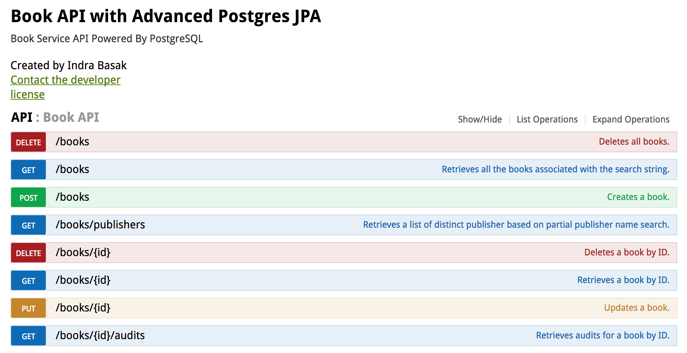

[![Build Status][travis-badge]][travis-badge-url]


JPA PostgreSQL Spring Service Advanced Example
=================================================================================
This is a [**Spring Boot**](https://projects.spring.io/spring-boot/) based microservice example backed by
[**PostgreSQL**](https://www.postgresql.org/) database. This examples shows how to do the following:
* Use `DBCP datasource` with Java configuration.
* Use `Custom Repository` to expose `entity manager`.
* Insert `UUID` field in Postgres database and generate `UUID `index.
* Convert Java `Enum` to Postgres `Enum` type.
* Convert Java `Object` to Postgres `JSONB` type.
* Intercation with `named native queries` and `named stored procedure`.
* Custom `JsonType` to convert a JSON string returned from a native query to a Java bean.
* Use [`Dozer`](http://dozer.sourceforge.net/) Java Bean mapper.

### PostgreSQL Assumptions
* You have a PostgreSQL database server running on your `localhost` and in port `5432`.
* You have a database named `postgres` running on the server
* The server has a user named `postgres` with password `postgres`.
* If any of the assumptions doesn't hold true, change the `spring.datasource` properties in the `application.yml` file.

### Create Database Entities
Execute the `create-db.sql` script under `resources` directory on your PostgreSQL server either using  PostgreSQL administration and management tools, [pgAdmin](https://www.pgadmin.org/), 
or from the PostgreSQL interactive terminal program, called `psql`.

### Build
Execute the following command from the parent directory:
```
mvn clean install
```

### Start the Service
The main entry point `jpa-postgres-jsonb` example is `com.basaki.example.postgres.jsonb.boot.BookApplication` class.
You can start the application from an IDE by starting the `BookApplication` class.
```

  .   ____          _            __ _ _
  .   ____          _            __ _ _
 /\\ / ___'_ __ _ _(_)_ __  __ _ \ \ \ \
( ( )\___ | '_ | '_| | '_ \/ _` | \ \ \ \
 \\/  ___)| |_)| | | | | || (_| |  ) ) ) )
  '  |____| .__|_| |_|_| |_\__, | / / / /
 =========|_|==============|___/=/_/_/_/
 :: Spring Boot ::        (v1.4.5.RELEASE)
 ...
2017-04-16 18:32:32.947  INFO 49104 --- [           main] s.b.c.e.t.TomcatEmbeddedServletContainer : Tomcat started on port(s): 8080 (http)
2017-04-16 18:32:32.952  INFO 49104 --- [           main] c.b.e.p.jsonb.boot.BookApplication       : Started BookApplication in 7.879 seconds (JVM running for 8.309)
```
The application starts up at port `8080`.

### Accessing Swagger 
On your browser, navigate to `http://localhost:8080/` to view the Swagger. 


Click the `Show/Hide` link to view all the operations exposed by Book API.


[travis-badge]: https://travis-ci.org/indrabasak/jpa-postgres-advanced.svg?branch=master
[travis-badge-url]: https://travis-ci.org/indrabasak/jpa-postgres-advanced/